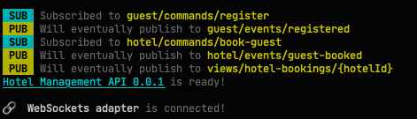

# CQRS / Event Sourcing with AsyncAPI
Event-sourcing practitioners design their domains using event-capturing methodologies like [Event Storming](https://www.eventstorming.com) and [Event Modeling](https://eventmodeling.org). The output from this work is usually a lot of sticky notes on real or digital whiteboards. From this model, developers have to fill in a lot of details about the commands, events and read models to build a working system. This mapping process is manual and happens in their heads. Human inspection and test suites ensure that the code matches the stickies. This process is not ideal as the actual system may not be what the event model expects.

The AsyncAPI specification gives us an opportunity to create design-first CQRS systems that map succinctly to the Event Modeled domain by creating an easy-to-read document that maps to the event model. This document fills in the data details for each command, event and read model. Verification is much simpler as the reviewer compares a single YAML document to the sticky notes. 

From this spec, projects generate a working event-driven platform skeleton, which developers fill in with business logic and integrations to an event storage system, projections storage systems, and other systems as called for in the Event Model.

This project is an example of this approach. It is not a complete implementation and only shows a few parts of the model, just enough to show how to use an AsyncAPI spec to build an event-driven CQRS / ES application.

#### Hotels Domain

Hotels are a common example domain in CQRS and Event Sourcing educational materials. The Event Modeling website has a nice [Hotels example to study](https://eventmodeling.org/posts/what-is-event-modeling/), and this project is loosely based on it’s artifacts. 

### Installation

1. Install a recent [Node runtime](https://nodejs.org/). This document assumes the reader is using JavaScript, but the generator supports other languages besides JS.

2. This project uses the AsyncAPI project’s [generator tooling](https://github.com/asyncapi/generator) to generate the server skeleton from an AsyncAPI spec.

   In the terminal, run `npm install`

3. Once the tooling install is complete, you can generate the code skeleton:

   In the terminal, run `npm run generate`

4. This will create a project in the `output/` folder.

### Project Files of Interest

The first file to review is the [`hotels.yaml`](./hotels.yaml) spec. It contains definitions for a few commands and events. AsyncAPI calls these “channels” and they are defined like normal topic names. I have used naming conventions to group related channels together.

##### Commands and Events

`{entity}/commands/{command-name}`

`{entity}/events/{event-name}`

This convention groups the commands and events by the entity they affect and represent state for.

- guest/commands/register
- guest/events/registered
- hotel/commands/book-guest
- hotel/events/guest-booked

Commands and Events share a base schema that stores metadata in a `headers` field. This field contains things like correlationId, actor, timestamp, and whatever metadata you wish to track across all command and event types. This schema, called `shared-headers`, is in the `components` section of the spec file. 

##### Views (aka Read Models)

`views/{view-name}/{view-id}`

Views are aggregations of events, often from different entities. Each view instance will have it’s own channel instance. This project has a single view definition:

- views/hotel-bookings/{hotelId}

##### Generated Code

You can find the generated code in the `output` directory. This directory is a node project, so to get started, install the dependencies

 In the terminal, run `npm install`

Once the install is complete, you can launch the generated server:

`npm start`

You will see out describing the available channels.

SUB means a handler is listening on the channel name. PUB means a handler is ready to publish messages. The source code for these handlers is in `output/src/api/handlers/` and the rest of the code in the project is all the wiring needed to bring the API to life.

### Not Included

This project has not implemented the code to turn commands into events, and events into views. The main point of this little project is to show how to use AsyncAPI to map from an event model to a spec, and from the spec to a running system. This approach keeps design-first thinking in your process by filling in one of the main gaps between the whiteboard events and code.
